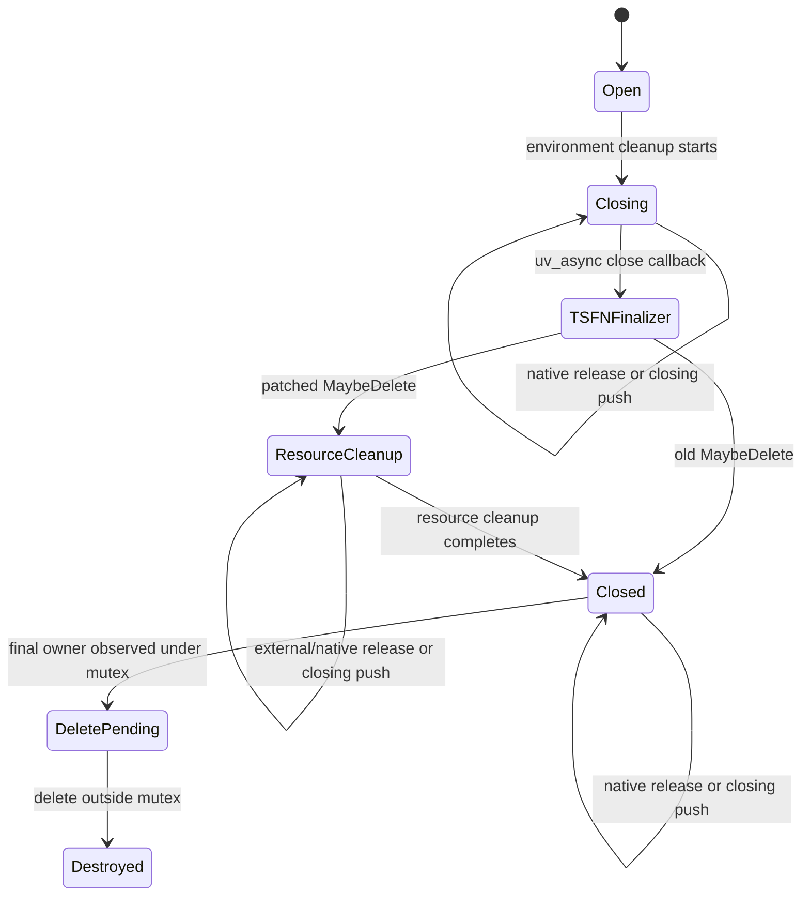

# TSFN Teardown Model

This TLA+ model captures the published `napi_threadsafe_function` teardown path involved in nodejs/node#65100. It models two valid native owners, `Open -> Closing`, async-handle closure, the user TSFN finalizer, `MaybeDelete()`, `env->Unref()` synchronously invoking an external finalizer, native `Release()` and closing `Push()` calls, and physical destruction. It deliberately excludes queue contents, arbitrary owner counts, V8, and libuv implementation details.

`Fixed = FALSE` is the old implementation. It changes state directly from `Closing` to `Closed`, then holds the TSFN mutex while `env->Unref()` invokes the external finalizer. TLC reaches the abstract `ReentrantLock` sentinel, representing the real self-deadlock/abort in `uv_mutex_lock`, and violates `NoReentrantLock`.

`Fixed = TRUE` is the patched implementation. It enters `ResourceCleanup`, which blocks destruction but leaves the TSFN mutex unlocked. The external finalizer and native thread can release their owners before, during, or after resource cleanup. Only after `env->Unref()` returns does the loop publish `Closed`. The locked deletion decision sets `delete_pending`; a separate unlocked transition then destroys the TSFN.

Run the models with the TLA+ tools jar:

```sh
java -XX:+UseParallelGC -cp /path/to/tla2tools.jar tlc2.TLC -config old.cfg TSFNTeardown.tla
java -XX:+UseParallelGC -cp /path/to/tla2tools.jar tlc2.TLC -config fixed.cfg TSFNTeardown.tla
```

The old model must violate `NoReentrantLock`. The fixed model must complete without violating `TypeOK`, `NoReentrantLock`, `ClosedAfterResources`, `NoDeleteDuringCleanup`, `DeleteDecisionSafe`, `SafeDeletion`, or `ResourcesReleasedOnce`. `DeleteDecisionSafe` checks the interval between observing the final owner under the mutex and executing `delete this`. `CHECK_DEADLOCK FALSE` is intentional because physical destruction is a terminal state.



Old counterexample:

```mermaid
sequenceDiagram
    participant Loop as Worker loop
    participant Mutex as TSFN mutex
    participant Env as N-API environment
    participant Finalizer as External finalizer

    Loop->>Mutex: set Closed, lock
    Loop->>Env: env->Unref() while locked
    Env->>Finalizer: invoke finalizer
    Finalizer->>Mutex: release TSFN
    Mutex-->>Finalizer: self-deadlock, modeled as ReentrantLock
```

Patched behavior:

```mermaid
sequenceDiagram
    participant Loop as Worker loop
    participant Mutex as TSFN mutex
    participant Env as N-API environment
    participant Finalizer as External finalizer
    participant Native as Native owner

    Loop->>Mutex: set ResourceCleanup, unlock
    Loop->>Env: env->Unref()
    Env->>Finalizer: invoke finalizer
    Finalizer->>Mutex: release owner 1
    Native->>Mutex: release owner 2
    Loop->>Mutex: env->Unref() returns, set Closed
    Loop->>Mutex: destroy if no owners remain
```

TLC proves safety only for this finite abstraction. The C++ cctests establish correspondence with the actual worker/environment teardown ordering. Sanitizer and cross-platform CI runs remain necessary for implementation-level memory and scheduling correctness.
